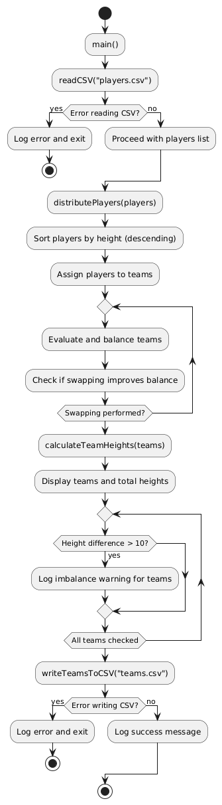

# Team Distribution Program

This program reads player data from a CSV file, distributes players into balanced teams, and writes the results back into a CSV file. The balancing process is designed to minimize the difference in total height among teams.

## Features

- Reads player data from a CSV file.
- Distributes players into balanced teams based on height.
- Evaluates and adjusts team compositions to ensure balance.
- Outputs the final team composition to a CSV file.

## Flowchart

The flowchart below illustrates the main operations of the program:



## How to Run the Program

1. Ensure you have Go installed on your machine.
2. Prepare a CSV file named `players.csv` with the following format:

    ```
    Name,Height
    Player1,180
    Player2,175
    Player3,160
    ```

3. Run the program:

    ```bash
    go run main.go
    ```

4. Check the output in `teams.csv` for the distributed team details.

## Functions

- `readCSV(filename string) ([]Player, error)`: Reads player data from a specified CSV file.
- `distributePlayers(players []Player) [][]Player`: Distributes players into teams while balancing total heights.
- `evaluateAndBalanceTeams(teams [][]Player, teamHeights []int)`: Evaluates and balances the teams by swapping players.
- `calculateTeamHeights(teams [][]Player) []int`: Calculates the total height of each team.
- `writeTeamsToCSV(filename string, teams [][]Player) error`: Writes the final team data into a specified CSV file.

## License

This project is licensed under the MIT License - see the [LICENSE](LICENSE) file for details.
